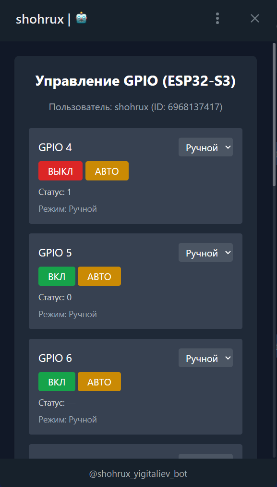
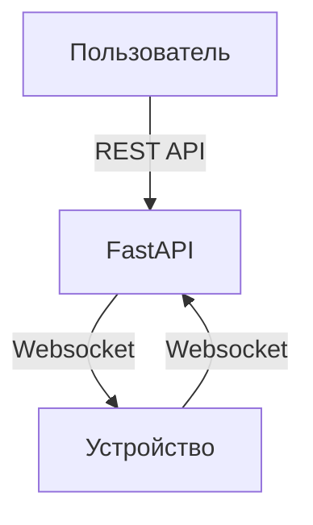

# Sh_IoT_standard
Стандартная версия

# Sh_IoT — Умная система управления устройствами через WebSocket
IoT-платформа на базе FastAPI, обеспечивающая удалённое управление устройствами через ESP32 и Web-интерфейс.

# Стандартная версия включает: 
1. Базовые команды управления: вкл-выкл, расписание.
2. Количество устройств: 1
3. С++ код для устройства
4. Интерфейс: Телеграм бот, с использованием Веб-приложения 

# Возможности
1. Управление устройствами(ESP32, ESP8266, Raspberry pi) удалённо
2. Ручное управление: вкл-выкл в реальном времени
3. Автоматическое управление: расписание(8.00 - 18.00)
4. Каждый пин устройства управляется отдельно
5. Можно назвать пины, для удобства. 5-пин - Освещение, 6-пин - Розетка и т.д
6. Возможность получать уведомления-логи в телеграм бот: изменения состояния пинов, выполнение команд


# Архитектура

# Используемые технологии
- Python 3.13
- FastAPI
- Aiogram. 
- ESP32S3 Dev Module (Arduino C++)
- WebSockets (TLS)
- Библиотека aiohttp
- Библиотека pyee (для фиксации, обработки и контроля событий)


# Установка и запуск
```bash

git clone https://github.com/shohrux508/Sh_IoT_standard.git
cd Sh_IoT_standard
pip install -r requirements.txt
uvicorn app.main:app --reload
```
# Безопасность
1. Проверка токена перед подключением.
2. Использование TLS

# Автор
Шохрух ([@shohrux508](https://github.com/shohrux508))
Telegram ([@shohrux_yigitaliyev](https://t.me/shohrux_yigitaliyev))
